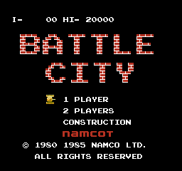

# Battle City (Kotlin)

## Overview

**Battle City** is a multi-directional shooter where the player controls a tank to destroy the enemies and protect the base. The game was produced and published in 1985 by Namco.
This is a recreation of the classic game implemented using the Kotlin programming language. The project aims to faithfully replicate the gameplay and experience of the original game while adding modern coding practices and features in educational purposes.

## Features
* Classic top-down tank battle gameplay.
* Single-player ~~and cooperative multiplayer modes~~.
* A variety of enemy tanks with different behaviors and abilities.
* Power-ups and obstacles to enhance gameplay.
* ~~Sound and visual effects faithful to the original game.~~
* ~~Customizable controls for an improved gaming experience.~~

## Credits
### Original Game
* "Battle City" - The original game was developed by Namco and is a copyrighted property of Namco. I am deeply grateful to Namco for creating this classic game, which has inspired this recreation project.
### Inspirations and Tools
* The work done by the [newagebegins/BattleCity](https://github.com/newagebegins/BattleCity) team for providing a solid reference for a starting point.
* The work done by the [orangelando/nsf](https://github.com/orangelando/nsf) team that with some tweaks was used to recreate sounds of the original game.

## License
This project is licensed under the [MIT License](LICENSE).